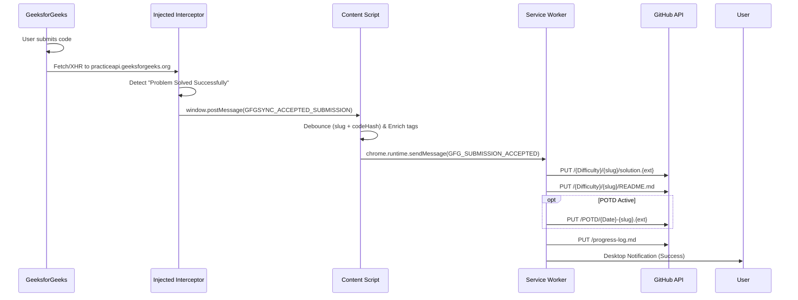

# GfGSync-Mini 🚀

A lightweight, automated Chrome Manifest V3 extension that intercepts and syncs accepted **GeeksforGeeks** problem submissions directly to your GitHub repository.

---

## ✨ Features

- **⚡ Zero-Click Automatic Sync**: Automatically commits your accepted solutions upon reaching *"Problem Solved Successfully"* or *"Correct Answer"*.
- **🔍 Main-World Network Interception**: Directly captures API responses from `practiceapi.geeksforgeeks.org` via monkey-patched `fetch` and `XMLHttpRequest`.
- **🛡️ Multi-Level Fallback**: Monaco editor extraction, Ace editor fallback, CodeMirror DOM inspection, and problem details API fallback.
- **📁 Organized Structure**:
  ```text
  {Difficulty}/{slugified-title}/
  ├── solution.{extension}
  └── README.md
  ```
- **📅 Problem of the Day (POTD) Mirroring**: Optionally mirrors daily POTD solutions to `POTD/{YYYY-MM-DD}-{slug}.{extension}`.
- **📊 Global Progress Tracking**: Automatically appends solved problems to a root `progress-log.md` table.
- **🔒 Privacy & Security**: Personal Access Tokens (PAT) are stored locally in `chrome.storage.local` (never logged, never synced to cloud).
- **⚠️ Defensive Error Handling**: Shows instant desktop alerts (`chrome.notifications`) on token issues (401), rate limits (403), repo not found (404), or auto-resolves SHA conflicts (409).

---

## 🛠️ Installation

1. Open Google Chrome and navigate to `chrome://extensions/`.
2. Enable **Developer mode** in the top right corner.
3. Click **Load unpacked** and select the `greeksforgreeks` folder.
4. Pin the **GfGSync-Mini** extension to your toolbar.

---

## ⚙️ Configuration

1. Click the **GfGSync-Mini** icon in your browser toolbar.
2. Enter your **GitHub Personal Access Token (PAT)**:
   - Needs `repo` or `contents:write` permission.
3. Enter your **Repo Owner** (e.g. `sushantshetty09`) and **Repo Name** (e.g. `DSA`).
4. Enter your **Target Branch** (e.g. `GreeksofGreeks` or `main`).
5. Click **Test Connection** to verify credentials, then click **Save Settings**.

---

## 🎯 How It Works


